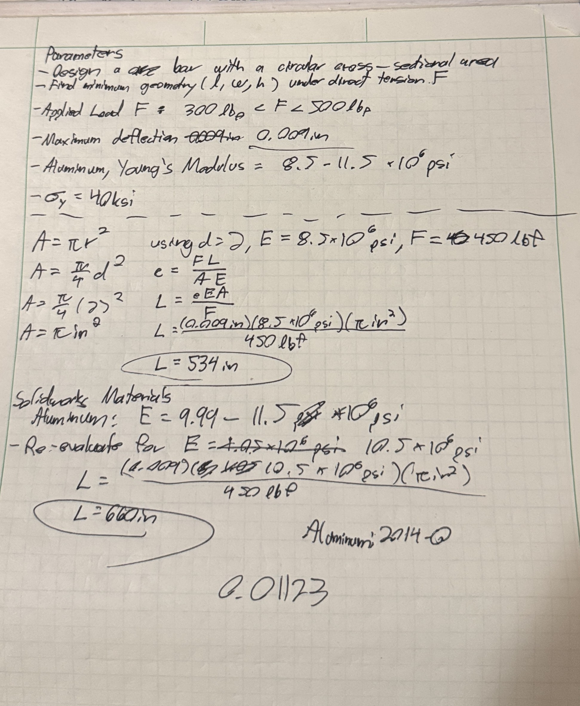
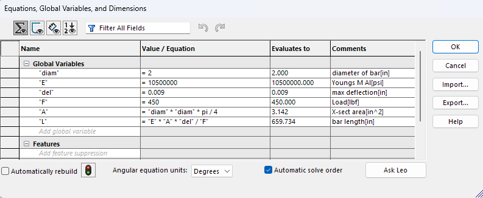

# A3 – [Parametric modelling and Finite Element Analysis]

## Objectives
To design a beam with a circular cross sectional area using the principles of parametric modelling, and verify the design using finite element analysis.

Modify parameters within the parametric modelling in order to visualize how the design changes.

## Analyze
### Parameters
Before any work on the beam is started, all available parameters must be known and documented. All of my notes are done on a physical pen and pad, so all of my initial notes are present on the document as well. 

### Part 1, A and B
Now that the parameters are known, the cross sectional area must be determined, and then the hand calculations can begin.
To simplify the area calculations, I decided on a radius of 1 inch for the beam, leaving a cross sectional area of pi inches squared. Additionally, a force of 450 lbf was selected as the applied force, as it split the difference between the upper and lower limit for the force parameter, and a Young's Modulus of 8500000 psi was selected for the material properties, as it was the lowest limit within the given parameters.
Using the axial loading elongation equation, the length was determined to be 534in.
### Part 1, C
In order to parametrically design, equations must be defined within Solidworks.

Substituting in the values, it returns the same beam length as the hand calculations.

However, there is no aluminum alloy in Solidworks with a Young's Modulus of 8500000 psi, so aluminum 2014-O was chosen, and the calulcations were repeated. Aluminum 2014-O has a Young's Modulus E = 10500000 psi
Once again, the hand calculations and Solidworks equations agreed, and both returned a beam length of 660in.

### Part 2, [Finite Element Analysis]
Using the parametrically designed beam and Solidworks' built in SimulationXpress, finite element analysis is conducted on the beam.

First, it generates a von Mises Stress Map

Second, it generates a deflection map

Using these maps, the peak stress in the beam is lower than the strength of aluminum (Sy = 40ksi), and results in a safety factor of [blank]. 

## Decide

## Communicate

