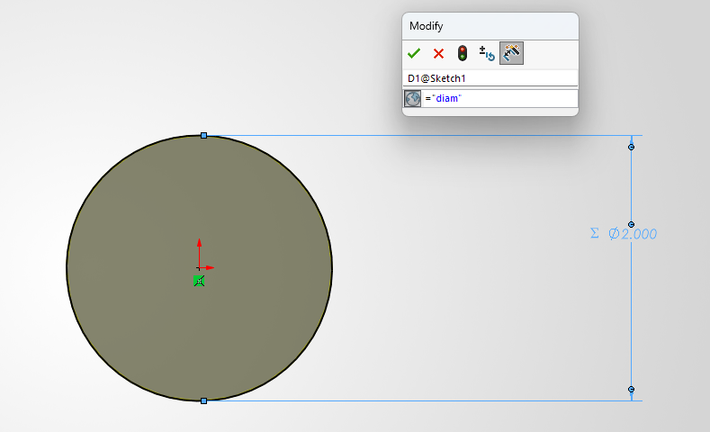

# A3 – [Parametric modelling and Finite Element Analysis]

## Objectives
To design a beam with a circular cross sectional area using the principles of parametric modelling, and verify the design using finite element analysis.

Modify parameters within the parametric modelling in order to visualize how the design changes.

## Analyze
### Parameters
Before any work on the beam is started, all available parameters must be known and documented. All of my notes are done on a physical pen and pad, so all of my initial notes are present on the document as well. This document is attached in Part 1, C.

### Part 1, A and B
Now that the parameters are known, the cross sectional area must be determined, and then the hand calculations can begin.
To simplify the area calculations, I decided on a radius of 1 inch for the beam, leaving a cross sectional area of pi inches squared. Additionally, a force of 450 lbf was selected as the applied force, as it split the difference between the upper and lower limit for the force parameter without being the exact middle, and a Young's Modulus of 8500000 psi was selected for the material properties, as it was the lowest limit within the given parameters.
Using the axial loading elongation equation, the length was determined to be 534in.
### Part 1, C
In order to parametrically design, equations must be defined within Solidworks.

Substituting in the values, it returns the same beam length as the hand calculations.

However, there is no aluminum alloy in Solidworks with a Young's Modulus of 8500000 psi, so aluminum 2014-O was chosen, and the calulcations were repeated. Aluminum 2014-O has a Young's Modulus E = 10500000 psi
Once again, the hand calculations and Solidworks equations agreed, and both returned a beam length of 660in.

Next, the beam was extruded to the length variable defined in the solidworks equations.

### Part 2, [Finite Element Analysis]

To test the bar, it first had to be parametrically designed. A circle was sketched, and the diameter was set to the diameter variable that was defined in the equations earlier.

Using the parametrically designed beam and Solidworks' built in SimulationXpress, finite element analysis is conducted on the beam.

First, it generates a deflection map

From this deflection map, the peak strain is noted as 0.00902in, which almost exactly matches the targeted peak strain of 0.009in

Second, it generates a von Mises Stress Map

This Stress Map notes the peak stress as 158.8 psi, and given that the yield strength of aluminum is given at 40 ksi, or 40,000 psi, the factor of safety is 251.9. Using the material characteristics in Solidworks, the yield strength of aluminum 2014-O is 13780 psi, this returns a factor of safety of 86.8. Either way, the bar will not fail under these conditions.

### Reflection
The given axial deflection was 0.009in, and the result from Solidworks was 0.009020 in. Calculation of the percent difference results in a 0.2% higher axial deflection in the simulated model. 

Given the governing equations for a simple axial loading is intended for this exact situation, it would be surprising if the results did not concur. If this were a more complex loading or scenario, the outcome may be different.

Between the 2, the FEA likely conducts more thorough calculations, and in my opinion, is a more trustworthy source. 

From the Machinery's Handbook, the stress concentration for a hole in a shaft is between K = 2-3. The working stress can then be calculated as Sw = K*sigma. This results in an approximate stress between 317.6 and 476.4. Even in the case of K = 3, this stress is still significantly lower than the yield strength of 13780 psi given by the material properties, and even still signifcantly lower than the provided yield stress of 40 ksi. 

### Modify Parameters

First, the load will be modified and tested at 300 lbf.
I predict that the 300 lbf load will result in a longer bar length than the 450 lbf.
Second, the diameter of the bar will be changed to 1in, which will decrease the cross-sectional area. I predict this will decrease the length of the bar.

As can be seen, the predicted results align with the results calculated in Solidworks.

## Conclusions
Overall, this project took about 6 hours to complete. 3 hours were spent on the calculations and FEA, while the other 3 were spent on this website. Overall, this was a relatively simple scenario, so there weren't many opportunities for mistakes. 

The CAD files for this assignment can be downloaded [Here test 1](CadlesCelica/megr2157-portfolio/docs/assignments/A03/A3 SoDesign.SLDPRT)
